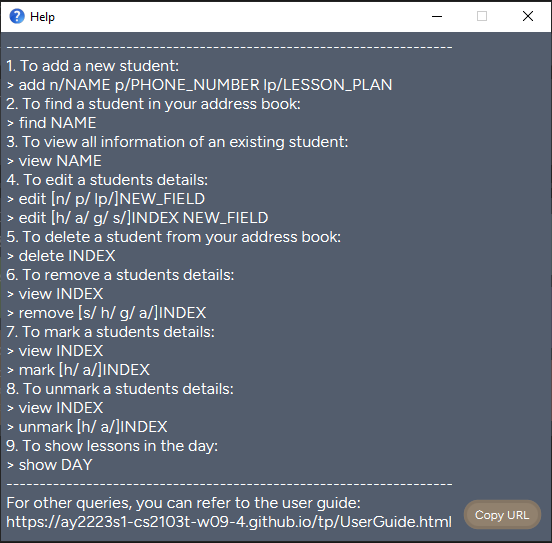
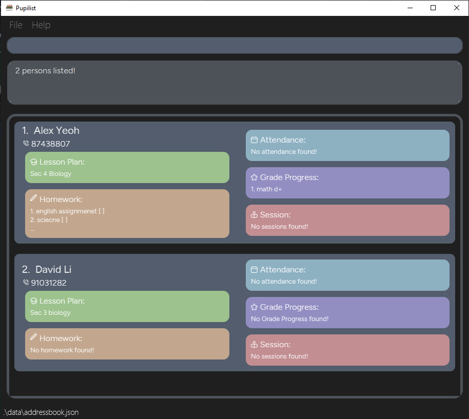

Pupilist is a **desktop app for managing students details for private tutors**. It is **optimised for Command Line Interface (CLI)**. If you are a private tutor struggling to keep track of your students grades, homework and attendance, Pupilist can get your scheduling done faster than traditional GUI apps.

* Table of Contents
{:toc}

--------------------------------------------------------------------------------------------------------------------

## Quick start

1. Ensure you have Java `11` or above installed in your Computer.

2. Download the latest `Pupilist.jar` from [here](https://github.com/AY2223S1-CS2103T-W09-4/tp/releases).

3. Copy the file to the folder you want to use as the _home folder_ for your AddressBook.

4. Double-click the file to start the app. The GUI similar to the below should appear in a few seconds. Note how the app contains some sample data. 
   

5. Type the command in the command box and press Enter to execute it. e.g. typing **`help`** and pressing Enter will open the help window. 
   Some example commands you can try:

   * **`list`** : Lists all contacts.

   * **`add`**`n/John Doe p/98765432 e/johnd@example.com a/John street, block 123, #01-01` : Adds a contact named `John Doe` to the Address Book.

   * **`delete`**`3` : Deletes the 3rd contact shown in the current list.

   * **`clear`** : Deletes all contacts.

   * **`exit`** : Exits the app.

6. Refer to the [Features](#features) below for details of each command.

--------------------------------------------------------------------------------------------------------------------

## Features

**:information_source: Notes about the command format:** 

* Words in `UPPER_CASE` are the parameters to be supplied by the user. 
  e.g. in `add n/NAME`, `NAME` is a parameter which can be used as `add n/John Doe`.

* Items in square brackets are optional. 
  e.g `n/NAME [h/HOMEWORK]` can be used as `n/John Doe h/math` or as `n/John Doe`.

* Items with `…`​ after them can be used multiple times including zero times. 
  e.g. `[h/Homework]…​` can be used as ` ` (i.e. 0 times), `h/Math`, `h/Math h/Science` etc.

* Parameters can be in any order. 
  e.g. if the command specifies `n/NAME p/PHONE_NUMBER`, `p/PHONE_NUMBER n/NAME` is also acceptable.

* If a parameter is expected only once in the command but you specified it multiple times, only the last occurrence of the parameter will be taken. 
  e.g. if you specify `p/12341234 p/56785678`, only `p/56785678` will be taken.

* Extraneous parameters for commands that do not take in parameters (such as `help`, `list`, `exit` and `clear`) will be ignored. 
  e.g. if the command specifies `help 123`, it will be interpreted as `help`.

### Viewing help : `help`

Shows a message explaining how to access the help page, and a list of basic commands.

Format: `help`

### Adding a person: `add`

Adds a person to the address book.

Format: `add n/NAME p/PHONE_NUMBER [h/HOMEWORK a/ATTENDANCE g/GRADE_PROGRESS lp/LESSON_PLAN]`

:bulb: **Tip:**
A person must minimally have 2 tags, with one being NAME and/or PHONE_NUMBER

Examples:
* `add n/Farisa p/87159999 h/math done a/12/08/2022 g/D+ lp/tutorial 2`

### Listing all persons : `list`

Shows a list of all persons in the address book.

Format: `list`

### Editing a person : `edit`

Edits an existing person in the address book.

Format: `edit INDEX [n/NAME p/PHONE h/HOMEWORK a/ATTENDANCE g/GRADE_PROGRESS lp/LESSON_PLAN]`

* Edits the person at the specified `INDEX`. The index refers to the index number shown in the displayed person list. The index **must be a positive integer** 1, 2, 3, …​
* At least one of the optional fields must be provided.
* Existing values will be updated to the input values.
* When editing tags, the existing tags of the person will be removed i.e adding of tags is not cumulative.
* You can remove all the person’s tags by typing `t/` without
    specifying any tags after it.

Examples:
*  `edit 1 p/91234567 h/math not done` Edits the phone number and email address of the 1st person to be `91234567` and `math not done` respectively.

### Locating persons by name: `find`

Finds persons whose names contain any of the given keywords.

Format: `find KEYWORD [MORE_KEYWORDS]`

* The search is case-insensitive. e.g `hans` will match `Hans`
* The order of the keywords does not matter. e.g. `Hans Bo` will match `Bo Hans`
* Only the name or phone number is searched.
* Only full words will be matched e.g. `Han` will not match `Hans`
* Persons matching at least one keyword will be returned (i.e. `OR` search).
  e.g. `Hans Bo` will return `Hans Gruber`, `Bo Yang`

Examples:
* `find John` returns `john` and `John Doe`
* `find 81112222` returns person with number `81112222`
* `find alex david` returns `Alex Yeoh`, `David Li` 
  

### Viewing persons details: `view`

View details of a person.

Format: `view n/NAME` `view p/PHONE_NUMBER`

* The command requires either the `NAME` **or** `PHONE_NUMBER` of the person to be viewed

### Deleting a person : `delete`

Deletes the specified person from the address book.

Format: `delete n/NAME` `delete p/PHONE_NUMBER`

* Deletes the person with the specified `NAME` or `PHONE_NUMBER`

Examples:
* `delete Betsy` removes Betsy from the address book.
* `delete 82378904` removes person with number 82378904 from address book.

### Clearing all entries : `clear`

Clears all entries from the address book.

Format: `clear`

### Exiting the program : `exit`

Exits the program.

Format: `exit`

### Saving the data

Pupilist data are saved in the hard disk automatically after any command that changes the data. There is no need to save manually.

### Editing the data file

Pupilist data are saved as a JSON file `[JAR file location]/data/addressbook.json`. Advanced users are welcome to update data directly by editing that data file.

:exclamation: **Caution:**
If your changes to the data file makes its format invalid, AddressBook will discard all data and start with an empty data file at the next run.

### Archiving data files `[coming in v2.0]`

_Details coming soon ..._

--------------------------------------------------------------------------------------------------------------------

## FAQ

**Q**: How do I transfer my data to another Computer? 
**A**: Install the app in the other computer and overwrite the empty data file it creates with the file that contains the data of your previous AddressBook home folder. 
**Q**: How do I start? 
**A**: Launch the app and use the help to learn all about the commands! 
**Q**: Where do I check for updates on the app? 
**A**: Check periodically on github for our latest updates on the app.

--------------------------------------------------------------------------------------------------------------------

## Command summary

Action | Format, Examples
--------|------------------
**Add** | `add n/NAME p/PHONE_NUMBER [h/HOMEWORK a/ATTENDANCE g/GRADE_PROGRESS lp/LESSON_PLAN]…​`   e.g., `add n/James Ho p/22224444 h/math done a/12/09/2022 g/A+ lp/tutorial 3`
**Clear** | `clear`
**Delete** | `delete n/NAME`  `delete p/PHONE_NUMBER`  e.g., `delete James Ho`
**Edit** | `edit INDEX [n/NAME p/PHONE_NUMBER h/HOMEWORK a/ATTENDANCE g/GRADE_PROGRESS lp/LESSON_PLAN]…​`  e.g.,`edit 2 n/James Lee h/math not done`
**Find** | `find KEYWORD [MORE_KEYWORDS]`  e.g., `find James Jake`
**View** | `view n/NAME`  `view p/PHONE_NUMBER`  e.g., `view James Ho`
**List** | `list`
**Exit** | `exit`
**Help** | `help`
